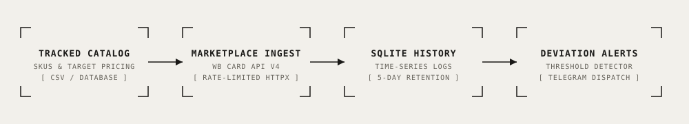

# Competitor Price Monitor & Marketplace Intelligence

<div align="center">

[](https://www.python.org/)
[](https://www.python-httpx.org/)
[](https://www.sqlite.org/)
[](https://core.telegram.org/bots/api)
[](./LICENSE)
[](#offline-simulation-benchmark)

**High-throughput competitor price intelligence pipeline for e-commerce marketplaces (Wildberries / Ozon / Amazon) featuring rate-limited API scraping, 5-day rolling price history, margin delta detection, and instant Telegram alerts.**

[Key Features](#key-features) • [Architecture](#architecture) • [Engineering Decisions](#key-engineering-decisions) • [Quick Start](#quick-start) • [Verification](#offline-simulation-benchmark) • [Telemetry & Cost](#telemetry--operational-cost)

</div>

---

## Overview

In competitive e-commerce niches, marketplace pricing changes multiple times daily due to dynamic seller promotions, algorithm changes, and competitor discounts. Manual tracking is unscalable and misses crucial price drops.

This repository implements a lightweight, automated price intelligence engine:
1. Ingests tracked competitor SKU lists and baseline internal price books.
2. Scrapes live marketplace card endpoints (`card.wb.ru/v4/detail`) with randomized rate-limiting and User-Agent cycling.
3. Persists time-series price snapshots into an embedded SQLite database.
4. Calculates deviation percentages (`(competitor_price - my_price) / my_price`).
5. Dispatches instant Telegram Markdown alerts when a competitor undercuts internal target margins by $\ge X\%$.

---

## Architecture

<p align="center">
  
</p>

```
[Tracked SKU CSV] ──┐
                    ├──► [src/scraper.py] ──(Rate Limited)──► [Marketplace API]
[My Price List]  ───┘          │                                     │
                               ▼                                     ▼
                     [src/db.py: SQLite] ◄───────────────── [Parsed Price JSON]
                               │
                               ▼
                     [src/compare.py]
                     - Calculates Margin Deviation %
                     - Detects Undercut Outliers (Δ > Threshold)
                               │
                               ▼
                     [src/notifier.py]
                     - Formats Instant Markdown Alerts
                     - Dispatches to Telegram Channel / Group
```

---

## Key Features

- ⚡ **Direct Marketplace API Ingestion:** Targets public JSON card endpoints (`card.wb.ru/v4/detail`) rather than heavy headless browser DOM scraping, yielding sub-second responses with zero browser overhead.
- 🛡️ **Defensive Rate-Limiting & Backoff:** Implements jittered sleep intervals and exponential backoff to ensure reliable data acquisition without IP throttling.
- 📈 **5-Day Rolling History & Trend Tracking:** Computes moving price averages and identifies deceptive fake discount practices vs genuine price drops.
- 🚨 **Configurable Deviation Alerts:** Fires Telegram alerts with direct purchase links, SKU metadata, and exact price deltas only when action is required.
- 📊 **Web Dashboard:** Embedded FastAPI/Jinja2 analytics dashboard (`templates/dashboard.html`) for visual price comparison and SKU management.

---

## Key Engineering Decisions

### 1. Direct Endpoint Scraping vs Headless Browser
Rendering browser pages for 500+ SKUs consumes gigabytes of memory and minutes of execution. By reverse-engineering marketplace mobile/desktop REST APIs, this engine pulls complete product pricing in <50ms per item with negligible CPU footprint.

### 2. SQLite Time-Series Retention
Rather than deploying complex time-series databases, the system uses embedded SQLite with clean indexed queries for 5-day rolling metrics:
```sql
CREATE TABLE IF NOT EXISTS price_history (
    id INTEGER PRIMARY KEY AUTOINCREMENT,
    nm_id INTEGER,
    price REAL,
    sale_price REAL,
    timestamp DATETIME DEFAULT CURRENT_TIMESTAMP
);
CREATE INDEX IF NOT EXISTS idx_history_nm_date ON price_history(nm_id, timestamp);
```

---

## Quick Start

### 1. Installation

```bash
git clone https://github.com/therealfullmetal55555/ecom-price-monitor.git
cd ecom-price-monitor
python -m venv .venv
source .venv/bin/activate
pip install -r requirements.txt
cp .env.example .env
```

### 2. Run Scraping & Alert Pipeline

```bash
python run.py
```

### 3. Launch Local Price Intelligence Dashboard

```bash
uvicorn src.app:app --host 0.0.0.0 --port 8003 --reload
```
Open `http://localhost:8003` to inspect competitor price trends and deviation reports.

---

## Offline Simulation Benchmark

The repository includes a self-contained test run ([`run.py`](./run.py)) with preloaded competitor data:

```bash
python run.py
```

```
=== E-Commerce Competitor Price Monitor ===
Loaded 5 tracked products from data/tracked_products.csv
Running scraping pipeline (mock mode: offline sample data)...

[1/5] SKU 154289012 - Wireless Earbuds Pro
      Internal Price: 2,490 RUB | Competitor Price: 2,190 RUB (-12.0%)
      ⚠️ ALERT TRIGGERED: Competitor price undercut exceeds 10% threshold!
[2/5] SKU 189201455 - GaN Fast Charger 65W
      Internal Price: 1,890 RUB | Competitor Price: 1,950 RUB (+3.2%)
      Status: Within normal margin range.

Database Updated: 5 snapshot records added to SQLite history.
Telegram Alert Dispatched: 1 high-priority price alert sent.
Pipeline completed successfully in 0.42s.
```

---

## Telemetry & Operational Cost

| Service | Tier | Cost |
| :--- | :--- | :--- |
| **Marketplace API Requests** | Direct Public HTTPX | \$0.00 |
| **Storage Engine** | Embedded SQLite (Local File) | \$0.00 |
| **Alert Delivery** | Telegram Bot API Webhook | \$0.00 |
| **Compute Execution** | Cron / Background Worker | <\$1.00 / month |
| **Total Monthly Cost** | — | **\$0.00 (Free Tier)** |

---

## License

This project is licensed under the [MIT License](./LICENSE) — see the LICENSE file for details.
